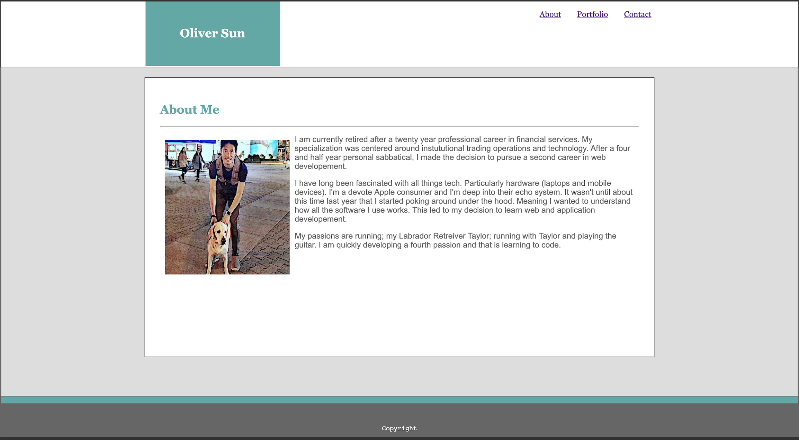
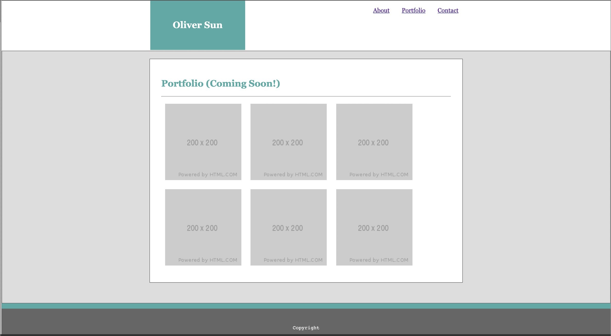
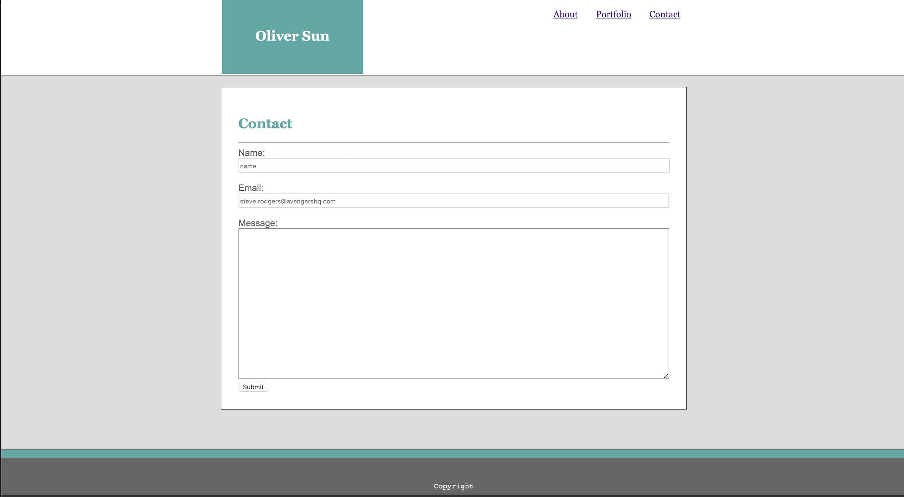

# Basic-Portfolio-New
Updated files and structure for BP Homework

## Page previews: 

## About the project:
  * For our bonus first homework assignment, we had to make our own Basic-Portfolio page mock-up but matching the specs from the demo pages in the assignment. Though some of my proportions are a little off from the demo pages, I'm confident I would have matched much closer with a little more time. Given that it's close to the cut-off time, I wanted to at least submit a minimum viable product.

## Techologies used to build:
  * HTML
  * CSS
  * CSS Grid Generator Tool

## Methodology:
  I made a grid for the basic layout and applied it to all three HTML files. I then used mostly margin, padding, height and width properties to eyeball the remaining elements.

## Acknowledgments:
  I have been playing around with CSS grid in the weeks leading up to Bootcamp. I've used this site to stucture my practive pages previously.
  * https://cssgrid-generator.netlify.com/